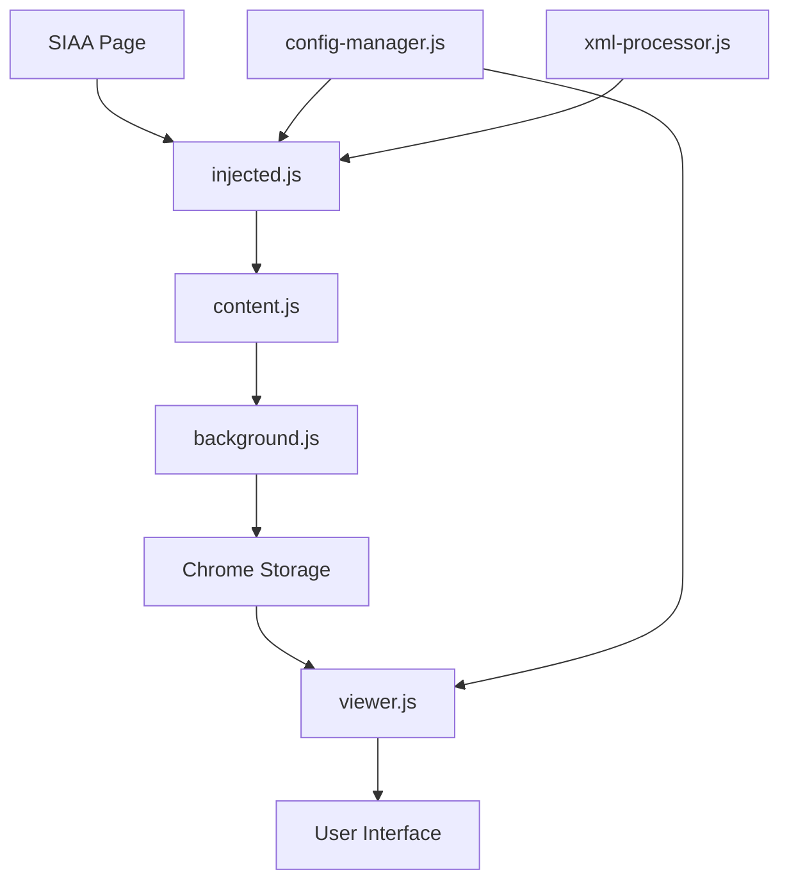

# 📚 SIAA Data Extractor v2.0.5

Uma extensão moderna e profissional para Chrome/Edge que permite extrair, visualizar e analisar dados acadêmicos do Sistema SIAA da Universidade Cruzeiro do Sul com interface elegante e funcionalidades avançadas.

## 🌟 Novidades v2.0.5

### 🎨 **Interface Sóbria e Profissional**
- **Design Unificado**: Interface consistente em toda aplicação com gradientes sutis e sombras elegantes
- **Estilo Glassmorphism**: Efeitos de backdrop blur e transparências modernas
- **Cores Harmoniosas**: Paleta sóbria em tons de cinza, branco e acentos azuis
- **Experiência Visual Premium**: Animações suaves e feedback visual refinado

### 🔧 **Melhorias de Usabilidade**
- **Filtros Inteligentes**: Sistema aprimorado sem adição automática de ponto e vírgula
- **Filtros Independentes**: Estados completamente isolados entre visualizações de Ofertas e Alunos
- **Interface Otimizada**: Layout reorganizado com melhor distribuição de elementos
- **Nomes de Cursos Completos**: Exibição de nomes completos no popup usando mapeamento inteligente

### ⚡ **Performance e Confiabilidade**
- **Mapeamento Persistente**: Nomes de cursos salvos automaticamente no storage
- **Sistema Robusto**: Tratamento avançado de erros de contexto da extensão
- **Mesclagem Inteligente**: Dados de alunos mesclados automaticamente como ofertas
- **Avisos Contextuais**: Notificações específicas para falhas de salvamento

## 🚀 Funcionalidades Principais

### 🔍 **Extração de Dados Avançada**
- **Ofertas de Disciplinas**: Código, nome, campus, horários, professores, vagas e matrículas
- **Dados de Alunos**: RGM, nome, e-mail, turma, turno, situação + Nome do Curso e Sigla Campus
- **Captura Inteligente**: Sistema que detecta e captura dados de múltiplos campus automaticamente
- **Deduplicação Visual**: Interface para seleção manual de duplicatas a serem removidas
- **Mapeamento de Cursos**: Sistema automático que relaciona códigos de curso com nomes completos

### 📊 **Visualização e Análise Moderna**
- **Interface Responsiva**: Design adaptável para desktop e mobile com layout otimizado
- **Filtros Avançados Independentes**: Estados isolados por visualização (Ofertas/Alunos)
- **Filtros Múltiplos**: Suporte a múltiplos valores usando ponto e vírgula (`;`)
- **Ordenação Dinâmica**: Clique nas colunas para ordenar com indicadores visuais
- **Presets Inteligentes**: Configurações predefinidas para diferentes necessidades
- **Alternância Fluida**: Transição suave entre modos de visualização
- **Contadores em Tempo Real**: Estatísticas atualizadas dinamicamente

### 📋 **Gerenciamento de Dados Profissional**
- **Exportação Flexível**: CSV completo ou apenas registros filtrados
- **Importação e Mesclagem**: Combine dados de diferentes capturas automaticamente
- **Gerenciamento Visual de Colunas**: Interface intuitiva para ocultar/exibir e reordenar
- **Armazenamento Confiável**: Dados salvos com verificação de integridade
- **Backup Automático**: Sistema de persistência com avisos de falha

## 🛠️ Instalação e Configuração

### Pré-requisitos
- **Navegador**: Google Chrome ou Microsoft Edge (versão recente)
- **Acesso**: SIAA da Universidade Cruzeiro do Sul
- **Credenciais**: Login válido no sistema acadêmico

### Instalação
1. **Baixe** a extensão ou clone o repositório
2. **Abra** Chrome/Edge → Extensões → Modo Desenvolvedor
3. **Carregue** a pasta da extensão
4. **Ative** a extensão na barra de ferramentas

## 📖 Guia de Uso Completo

### 1️⃣ **Captura de Dados**

#### Preparação
1. **Acesse o SIAA**: Faça login em https://siaa.cruzeirodosul.edu.br
2. **Navegue para**: Acadêmico → Consultas → Consultas De Ofertas Por Curso
3. **Verifique**: Se a página carregou corretamente

#### Processo de Captura
1. **Ative a Extensão**: Clique no ícone da extensão (interface sóbria aparecerá)
2. **Selecione o Curso**: Dropdown mostra nomes completos dos cursos
3. **Inicie Captura**: Clique em "🔄 Capturar Dados"
4. **Acompanhe**: Progresso em tempo real com mensagens informativas
5. **Aguarde**: Captura automática de ofertas e dados de alunos
6. **Verificação**: Sistema confirma salvamento com avisos se houver falha

#### Recursos da Captura
- **Mesclagem Automática**: Novos dados são combinados com existentes
- **Mapeamento de Cursos**: Nomes completos salvos automaticamente
- **Verificação de Integridade**: Avisos se dados não foram salvos
- **Recuperação de Erros**: Sistema robusto com tratamento de falhas

### 2️⃣ **Visualização de Dados**

#### Interface Principal
1. **Abra o Viewer**: Clique em "👁️ Visualizar" (abre interface moderna)
2. **Layout Otimizado**: Header com controles centralizados e estatísticas
3. **Navegação**: Botões "📊 Ofertas" e "👥 Alunos" para alternar modos

#### Sistema de Filtros Avançado
- **Filtros da Sidebar**: Campus, período, disciplina, professor, curso, horário
- **Filtros por Coluna**: Input em cada cabeçalho com sugestões inteligentes
- **Múltiplos Valores**: Use `;` para filtrar vários valores simultaneamente
- **Estados Independentes**: Filtros de Ofertas não afetam visualização de Alunos
- **Limpeza Contextual**: Botão "🧹 Limpar Filtros" limpa apenas modo atual

#### Funcionalidades Visuais
- **Contadores Dinâmicos**: Total e filtrados atualizados em tempo real
- **Indicadores Visuais**: Colunas ativas destacadas com bordas azuis
- **Sugestões Contextuais**: Dropdown com valores únicos baseados em dados
- **Feedback Imediato**: Animações e transições suaves

### 3️⃣ **Gerenciamento de Colunas**

#### Configuração Visual
1. **Acesse**: Botão "📊 Organizar Colunas" no header central
2. **Interface Intuitiva**: Checkboxes para visibilidade de colunas
3. **Presets Inteligentes**: Configurações predefinidas por contexto
4. **Salvamento Automático**: Preferências mantidas entre sessões

#### Opções Disponíveis
- **Reordenação**: Drag & drop para reorganizar colunas
- **Visibilidade**: Toggle individual para cada campo
- **Redimensionamento**: Ajuste de largura por coluna
- **Reset Inteligente**: Volta ao preset selecionado

### 4️⃣ **Exportação e Backup**

#### Menu Hamburger Moderno
1. **Acesse**: Botão hamburger elegante no header esquerdo
2. **Interface Sóbria**: Menu lateral com categorias organizadas
3. **Botões Uniformes**: Design consistente com gradientes sutis

#### Opções de Exportação
- **📥 Exportar Visível**: Apenas dados filtrados atualmente
- **⬇️ Exportar CSV Completo**: Todos os dados do modo atual
- **📋 Copiar Tabela Visível**: Para área de transferência
- **🔁 Importar e Mesclar**: Combina dados de arquivo CSV

#### Ferramentas de Manutenção
- **🔄 Limpar Duplicatas**: Interface visual para seleção de registros
- **🗑️ Limpar Todos os Dados**: Reset completo com confirmação
- **➕ Adicionar Curso**: Modal elegante para cursos manuais

## ⚙️ Configuração Avançada

### Sistema de Presets

#### Para Ofertas de Disciplinas
```json
{
  "PRESET_1_BASICO": {
    "name": "Básico",
    "order": ["Cód. Disc.", "Nome Disciplina", "Sigla Campus", "Hora", "Nome Professor"],
    "visible": ["Cód. Disc.", "Nome Disciplina", "Sigla Campus", "Hora", "Nome Professor"]
  },
  "PRESET_2_DETALHADO": {
    "name": "Detalhado", 
    "order": ["Cód. Disc.", "Nome Disciplina", "Sigla Campus", "Hora", "Nome Professor", "Vagas", "Matriculados", "Vagas Restantes"],
    "visible": ["Cód. Disc.", "Nome Disciplina", "Sigla Campus", "Hora", "Nome Professor", "Vagas", "Matriculados"]
  }
}
```

#### Para Dados de Alunos
```json
{
  "PADRAO": {
    "name": "Padrão",
    "order": ["RGM", "Nome", "E-mail", "Nome do Curso", "Sigla Campus"],
    "visible": ["RGM", "Nome", "E-mail", "Nome do Curso", "Sigla Campus"]
  },
  "PRESET_3_CURSO": {
    "name": "Foco em Curso",
    "order": ["Nome do Curso", "Sigla Campus", "RGM", "Nome", "Turma", "Turno"],
    "visible": ["Nome do Curso", "Sigla Campus", "RGM", "Nome", "Turma"]
  }
}
```

### Configuração Centralizada

#### Arquivo siaa-config.json
```json
{
  "api": {
    "academicPeriod": {
      "note": "Período obtido dinamicamente do sistema"
    },
    "extraction": {
      "batchSize": 10,
      "delayBetweenBatches": 800,
      "timeout": 30000
    }
  },
  "ui": {
    "theme": "sober",
    "animations": true,
    "compactMode": false
  },
  "features": {
    "autoMerge": true,
    "courseMapping": true,
    "independentFilters": true
  }
}
```

## 📊 Estrutura de Dados

### Ofertas de Disciplinas (Campos Principais)
| Coluna | Descrição | Fonte |
|--------|-----------|--------|
| Cód. Disc. | Código único da disciplina | SIAA XML |
| Nome Disciplina | Nome completo da disciplina | Processamento |
| Sigla Campus | Campus (SM, AF, LIB, etc.) | Mapeamento |
| Hora | Horários formatados | Processamento |
| Nome Professor | Professor responsável | SIAA XML |
| Vagas | Vagas disponíveis | SIAA XML |
| Matriculados | Alunos matriculados | SIAA XML |
| Vagas Restantes | Calculado automaticamente | Sistema |

### Dados de Alunos (Campos Principais)
| Coluna | Descrição | Fonte |
|--------|-----------|--------|
| RGM | Registro Geral de Matrícula | SIAA XML |
| Nome | Nome completo do aluno | SIAA XML |
| E-mail | Endereço eletrônico | SIAA XML |
| Nome do Curso | Nome completo do curso | Mapeamento |
| Sigla Campus | Campus de matrícula | Mapeamento |
| Turma | Código da turma | SIAA XML |
| Turno | Período de aulas | SIAA XML |
| Situação | Status da matrícula | SIAA XML |

## 🔒 Segurança e Privacidade

### Proteção de Dados
- **Armazenamento Local**: Todos os dados ficam no navegador do usuário
- **Sem Transmissão Externa**: Nenhuma informação enviada para servidores
- **Criptografia Nativa**: Usa sistema de storage seguro do Chrome
- **Controle Total**: Usuário pode limpar dados a qualquer momento

### Permissões Necessárias
- **activeTab**: Acesso controlado apenas à aba do SIAA
- **storage**: Armazenamento local de preferências e dados
- **scripting**: Execução de scripts para extração (somente no SIAA)

### Conformidade
- **LGPD**: Dados processados localmente sem compartilhamento
- **Transparência**: Código aberto para auditoria
- **Controle**: Usuário tem controle total sobre seus dados

## 🔧 Solução de Problemas

### Problemas Comuns e Soluções

#### "Dados não puderam ser salvos. Recarregue o SIAA"
**Sintomas**: Aviso vermelho pulsante no popup
**Causas**: 
- Contexto da extensão invalidado
- Falha na comunicação entre scripts
- Storage temporariamente indisponível

**Soluções**:
1. **Recarregue** a página do SIAA (F5)
2. **Reinicie** a extensão se necessário
3. **Limpe cache** do navegador
4. **Verifique** se não há atualizações da extensão

#### "Extension context invalidated"
**Sintomas**: Erro no console após reiniciar extensão
**Causa**: Scripts antigos tentando comunicar com contexto recarregado
**Solução**: **Recarregue** a página do SIAA

#### Filtros afetando visualização errada
**Sintomas**: Filtros de Alunos aparecendo em Ofertas
**Causa**: Bug em versões anteriores (corrigido na v2.0.5)
**Solução**: **Atualize** para versão atual

#### Nomes de curso não aparecem
**Sintomas**: Só códigos numéricos no popup/dados
**Causa**: Primeira execução sem mapeamento
**Solução**: **Execute** uma captura completa para popular mapeamento

### Logs de Debug

Abra Console do Desenvolvedor (F12) para diagnóstico:

```
🔧 [CONFIG] Sistema de configuração iniciado
🌐 [API] Buscando cursos disponíveis...
📚 [MAPPING] Curso mapeado: 68 -> CST em ANÁLISE...
📊 [DATA] Dados processados: 1247 ofertas, 3891 alunos
✅ [STORAGE] Dados salvos com sucesso
❌ [ERROR] Falha na comunicação - recarregue página
```

### Performance

#### Otimização de Uso
- **Filtre progressivamente**: Use filtros para reduzir dados exibidos
- **Capture por curso**: Melhor performance que captura global
- **Exporte seletivamente**: Apenas dados necessários
- **Mantenha atualizado**: Versões novas têm melhor performance

#### Limites Técnicos
- **Máximo recomendado**: 10.000 registros por visualização
- **Timeout de captura**: 30 segundos por requisição
- **Storage local**: Limitado pelo navegador (~5-10MB)

## 🎯 Casos de Uso Avançados

### 1. Análise de Ocupação por Campus
```
1. Capture dados de todos os cursos
2. Filtre por "Sigla Campus" = "SM;AF;LIB" 
3. Configure preset "Detalhado" para ver vagas
4. Exporte para análise de ocupação
```

### 2. Relatório de Alunos por Curso
```
1. Alterne para modo "👥 Alunos"
2. Filtre por "Nome do Curso" = curso desejado
3. Configure preset "Foco em Curso"
4. Exporte lista de alunos
```

### 3. Monitoramento de Horários
```
1. Use filtro "Horário" com múltiplos valores
2. Exemplo: "Segunda;Terça;19:10" 
3. Identifique conflitos de horário
4. Exporte relatório de sobreposições
```

### 4. Backup e Restore Completo
```
1. Menu hamburger → "⬇️ Exportar CSV Completo"
2. Salve arquivos de Ofertas e Alunos
3. Para restaurar: "⬆️ Importar CSV Completo"
4. Use "🔁 Importar e Mesclar" para combinar dados
```

## 🏗️ Arquitetura Técnica

### Componentes Principais

#### Frontend
- **popup.html/js**: Interface principal com design sóbrio
- **viewer.html/js**: Visualizador com filtros independentes  
- **Styling**: CSS moderno com gradientes e sombras

#### Backend
- **background.js**: Service Worker com storage robusto
- **content.js**: Bridge com tratamento de contexto
- **injected.js**: Extração com mapeamento de cursos

#### Configuração
- **config-manager.js**: Sistema centralizado de configuração
- **xml-processor.js**: Processamento inteligente de dados
- **siaa-config.json**: Configurações externalizadas

### Fluxo de Dados



### Inovações v2.0.5

#### Sistema de Mapeamento
```javascript
// Mapeamento persistente de cursos
window.__SIAA_CURSO_MAPPING = new Map();

// Salvamento automático
async function saveCursoMapping() {
    const mappingObj = Object.fromEntries(__SIAA_CURSO_MAPPING);
    await chrome.storage.local.set({siaa_curso_mapping: mappingObj});
}
```

#### Filtros Independentes
```javascript
// Estados isolados por modo
let filterStates = {
    ofertas: { columnFilters: {} },
    alunos: { columnFilters: {} }
};

// Acesso contextual
function getCurrentColumnFilters() {
    return filterStates[currentViewMode].columnFilters;
}
```

#### Interface Sóbria
```css
/* Gradientes elegantes */
.btn-primary {
    background: linear-gradient(135deg, 
        rgba(255,255,255,0.95) 0%, 
        rgba(248,250,252,0.95) 100%);
    border-left: 3px solid #3b82f6;
    box-shadow: 0 2px 8px rgba(59,130,246,0.15);
}
```

## 📈 Roadmap e Melhorias Futuras

### Versão 2.1.0 (Planejada)
- [ ] **Dashboard Analítico**: Gráficos e estatísticas visuais
- [ ] **Exportação Multi-formato**: PDF, Excel, JSON
- [ ] **Filtros Salvos**: Presets de filtros personalizados
- [ ] **Modo Escuro**: Tema alternativo elegante

### Versão 2.2.0 (Planejada)  
- [ ] **API de Integração**: Webhooks para sistemas externos
- [ ] **Relatórios Agendados**: Capturas automáticas programadas
- [ ] **Comparação Temporal**: Análise de mudanças entre períodos
- [ ] **Alertas Inteligentes**: Notificações de mudanças importantes

### Melhorias Contínuas
- [ ] **Performance**: Otimização para grandes volumes de dados
- [ ] **Acessibilidade**: Conformidade WCAG 2.1
- [ ] **Internacionalização**: Suporte multi-idioma
- [ ] **Mobile**: Interface otimizada para tablets

## 📄 Changelog Detalhado

### v2.0.5 (Atual) 🌟
- ✅ **Interface Sóbria Completa**: Design unificado com gradientes e sombras
- ✅ **Filtros Inteligentes**: Sem adição automática de ponto e vírgula
- ✅ **Estados Independentes**: Filtros isolados entre Ofertas/Alunos
- ✅ **Mapeamento de Cursos**: Nomes completos persistentes
- ✅ **Layout Otimizado**: Header reorganizado com controles centrais
- ✅ **Avisos Contextuais**: Notificações específicas para falhas
- ✅ **Robustez Melhorada**: Tratamento avançado de erros de contexto

### v2.0.0 
- ✅ **Mesclagem de Alunos**: Dados combinados automaticamente
- ✅ **Campos Enriquecidos**: Nome do Curso e Sigla Campus
- ✅ **Filtros Múltiplos**: Suporte a valores separados por `;`
- ✅ **Deduplicação Visual**: Interface para seleção de duplicatas
- ✅ **Sistema Robusto**: Comunicação confiável entre componentes

### v1.3.0
- ✅ **Configuração Centralizada**: Sistema unificado em JSON
- ✅ **Verificação de Endpoints**: Saúde de ofertas e alunos  
- ✅ **Presets Externalizados**: Configurações flexíveis
- ✅ **Interface Responsiva**: Design adaptável
- ✅ **Suporte Completo**: Dados de alunos integrados

## 🤝 Suporte e Comunidade

### Canais de Suporte
- **Documentação**: Este README.md (sempre atualizado)
- **Configuração**: Edite `siaa-config.json` para personalizações
- **Issues**: Reporte problemas com logs detalhados
- **Desenvolvimento**: Contribuições bem-vindas

### Como Contribuir
1. **Fork** o repositório
2. **Configure** ambiente de desenvolvimento  
3. **Teste** mudanças thoroughly
4. **Documente** alterações no README
5. **Submit** pull request com descrição detalhada

### Boas Práticas para Issues
- **Inclua** versão do navegador e da extensão
- **Anexe** logs do console (F12)
- **Descreva** passos para reproduzir problema
- **Especifique** comportamento esperado vs. atual

---

## 💡 Dicas Avançadas de Uso

### Workflows Recomendados

#### Análise Semanal de Ocupação
```
Segunda-feira:
1. Capture dados atualizados de todos os cursos
2. Exporte backup completo
3. Configure filtros por período/campus
4. Gere relatórios de ocupação por área

Sexta-feira:
1. Compare com dados do início da semana
2. Identifique mudanças significativas  
3. Exporte deltas para análise
4. Prepare relatórios executivos
```

#### Gestão de Turmas
```
Início do Semestre:
1. Capture dados completos por curso
2. Configure presets específicos por necessidade
3. Estabeleça filtros padrão por área
4. Crie baseline de comparação

Meio do Semestre:
1. Recapture dados atualizados
2. Use "🔁 Mesclar" para combinar histórico
3. Analise mudanças de matrícula
4. Identifique tendências de ocupação
```

### Otimização de Performance

#### Para Grandes Volumes
```javascript
// Configuração recomendada em siaa-config.json
{
  "extraction": {
    "batchSize": 5,        // Reduzir para conexões lentas
    "delayBetweenBatches": 1200,  // Aumentar delay
    "timeout": 45000       // Timeout maior
  }
}
```

#### Limpeza Periódica
```
Mensalmente:
1. Execute "🔄 Limpar Duplicatas" 
2. Remova dados obsoletos com "🗑️ Limpar Todos"
3. Recapture dados frescos
4. Reorganize presets conforme necessidade
```

---

**🎯 SIAA Data Extractor v2.0.5** - A ferramenta mais avançada para análise acadêmica da Universidade Cruzeiro do Sul. Interface moderna, funcionalidades profissionais e confiabilidade empresarial.

---

*Desenvolvido com ❤️ para a comunidade acadêmica • Universidade Cruzeiro do Sul*